# Ensuring Release Quality

To make sure the we could deliver a release with acceptable quality, it is neccessary to do the following steps:
1. Create the required sources e.g. appSerive and VM with the help of **terraform**. It helps us to make sure that we always have the consitent enviroment.
2. Deploy  *fakeRestAPI* into azure appService, so it could be used for API testing with **Jmeter**
3. VM must be configured to be able to exeute **Selenium**
4. Use **Postman** to make sure API and all the HTTP Protocol like GET and POST are respoding correctly.
5. Automate all of the previous step in azure devops pipeline.


## Steps:
### 1. Create Azure storage account:
Please create the storage account by using this link [here](https://docs.microsoft.com/en-us/azure/developer/terraform/store-state-in-azure-storage).
Either use the same variable name in azure-pipeline.yml file or adjust pipeline file according to your used variable names.  
**HINT**: DO NOT FORGET TO SAVE THE PASSWORD FOT STORAGE ACCOUNT

### 2. Create SSH for VM:  
This key is required for VM deployment.
```bash
ssh-keygen -t rsa
```

### 3. Create terraform.tfvars
create "terraform.tfvars" and fill it with your azure data.
**HINT:**DO NOT ADD THIS FILE YOUR REPOSITRY
```yaml
# Azure GUIDS
subscription_id = <FILL IT>
client_id = <FILL TT>
client_secret = <FILL TT>
tenant_id = <FILL TT>

# Resource Group/Location
location = "East US"
resource_group = "rg-erq"
application_type = "erq"

# Network
virtual_network_name = "vnn_erq"
address_space = ["10.5.0.0/16"]
address_prefix_test = "10.5.1.0/24"

# Virtual Machine
vm_admin_username = "adminuser"
```

### 4. Create Azure Pipeline
Create azure devops pipeline as it is explained [here](https://docs.microsoft.com/en-us/azure/devops/pipelines/create-first-pipeline?view=azure-devops&tabs=java%2Ctfs-2018-2%2Cbrowser).

### 5. Create Service Connection for pipeline
Create service connecton as it is explained [here](https://docs.microsoft.com/en-us/azure/devops/pipelines/library/service-endpoints?view=azure-devops&tabs=yaml).
**HINT**: LEAVE THE RESOURCE GROUP EMPTY

### 6. Install Azure Pipeline Extension
Install the following azure pipeline extension:
* [Jmeter](https://marketplace.visualstudio.com/items?itemName=AlexandreGattiker.jmeter-tasks&targetId=625be685-7d04-4b91-8e92-0a3f91f6c3ac&utm_source=vstsproduct&utm_medium=ExtHubManageList)
* [Terraform](https://marketplace.visualstudio.com/items?itemName=ms-devlabs.custom-terraform-tasks&targetId=625be685-7d04-4b91-8e92-0a3f91f6c3ac&utm_source=vstsproduct&utm_medium=ExtHubManageList)
* [PublishHTMLReports](https://marketplace.visualstudio.com/items?itemName=LakshayKaushik.PublishHTMLReports&targetId=625be685-7d04-4b91-8e92-0a3f91f6c3ac&utm_source=vstsproduct&utm_medium=ExtHubManageList)

### 7. Add SSH KEY & terraform.tfvars to secureFile
Since we do not want to store the sensitive information in the repository, we need to use secureFile option of the created azure pipeline.
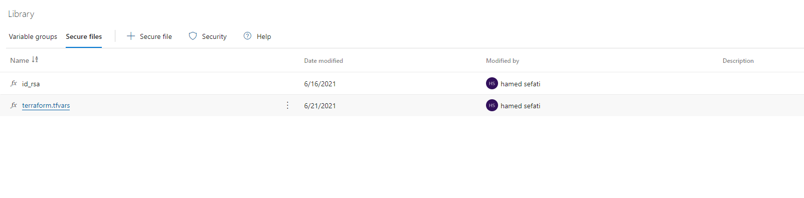  

### 8. Create Environment Pipeline
Create the following pipeline enviroment, so VM and Appservice can be configured during pipeline execution in the automatic manner.
* VM-CONFIG
* WEBAPP-DEPLOY  

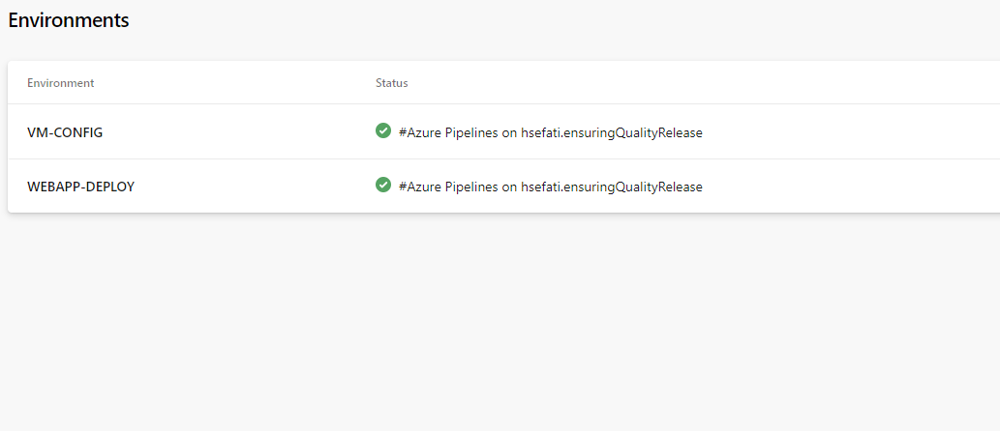  

### 9. Create Log Analytics workspace
Create the workspace with help of this [link](https://docs.microsoft.com/en-us/azure/azure-monitor/logs/quick-create-workspace-cli).  
The required files "azure-storage-account.sh" and "deploylaworkspacetemplate.json" can be found in root of the project.  
After creation of the workspace, please make sure that you update WORKSPACE_ID and PRIMARY_KEY in the azure pipeline yaml file.  
For more information please check these two Links ([1](https://www.cloudsma.com/2018/05/find-azure-log-analytics-keys/) and [2](https://docs.microsoft.com/en-us/azure/azure-monitor/logs/quick-create-workspace-cli) ).  
The workspace will be used for gathering all required logs and eventually logs analysis.

## Before Pipeline Run
To make sure that the pipleine can configure the created VM via terraform, we created the pipeline enviroments.
However, there is another step, that should be done once after creation of the VM. Therefore, there is waiting stage  
in the pipeline after terraform is finished. During the waiting period, you need to run the following steps:
1. After terraform is finished successfully, go to pipeline enviroment -> VM-CONFIG -> Add Resources
2. Choose the linux version
3. copy paste the given bash script
4. SSH into VM (with help of created SSH key earlier)
5. Execute the copied bash script

## During Pipeline Run

## Result of Pipeline Run
### Environment Creation & Deployment
* Log output of Terraform when executed by the CI/CD pipeline  
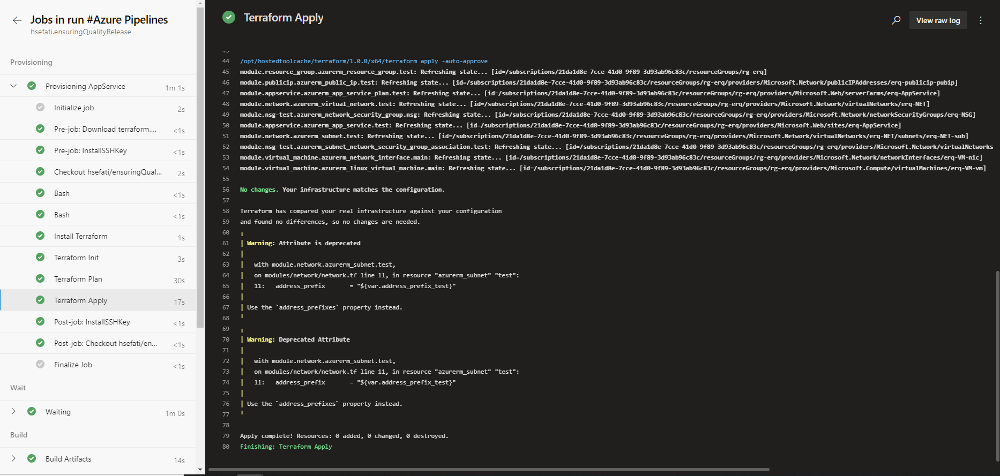  

* Successful execution of the pipeline build  
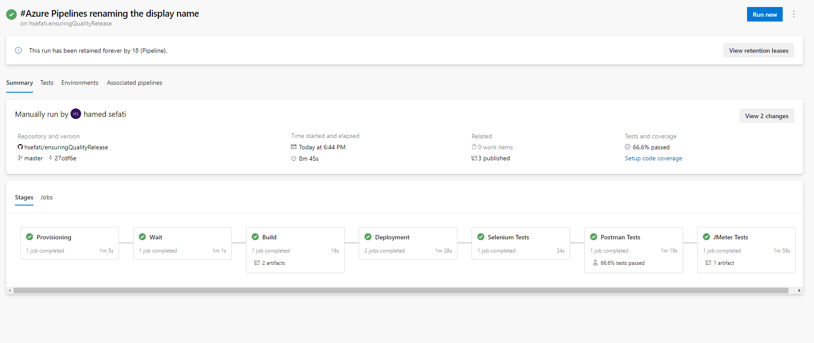  

### Automated Testing
* Log output JMeter  
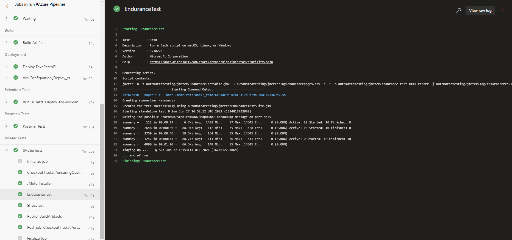  
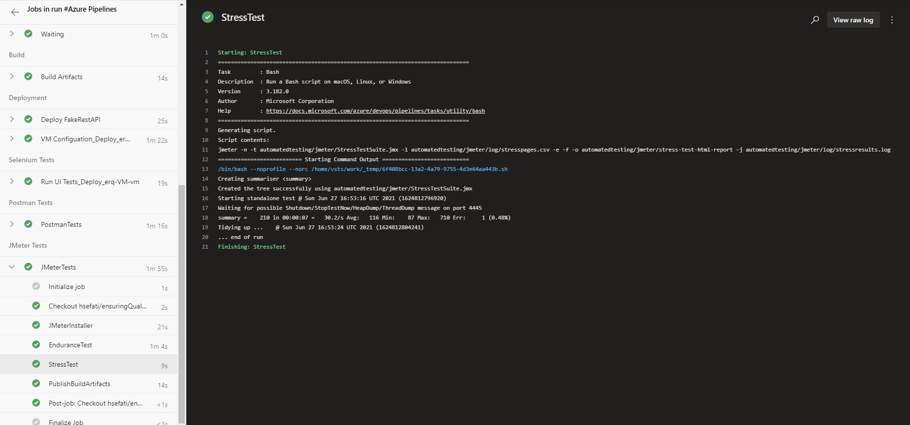  

* Log output Selenium  
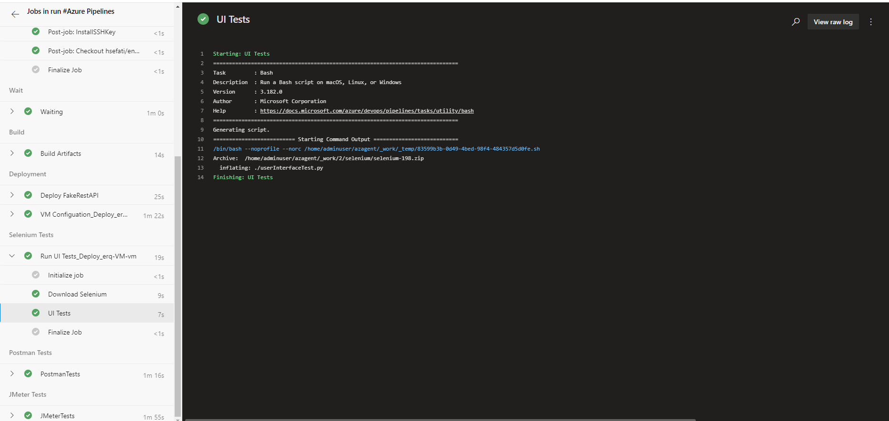  

* Log output Postman  
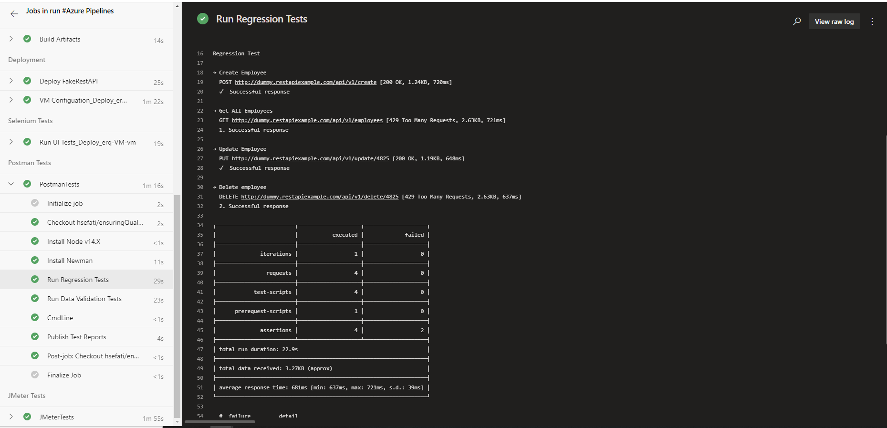
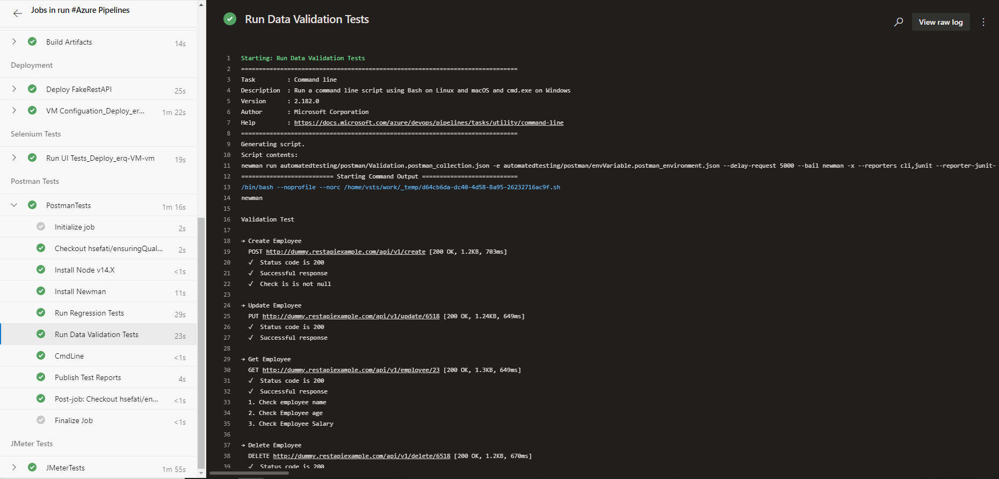

## After Pipeline Run
### Monitoring & Observability  
* Postman Test Report  
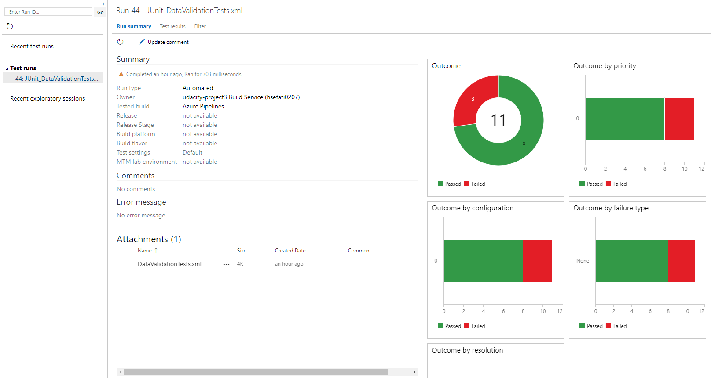  

* AppService HTTP 404 Alert Email  
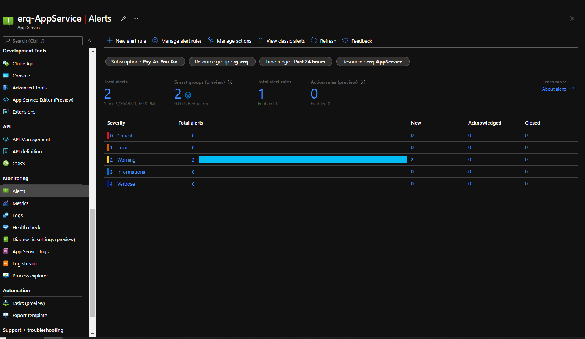  
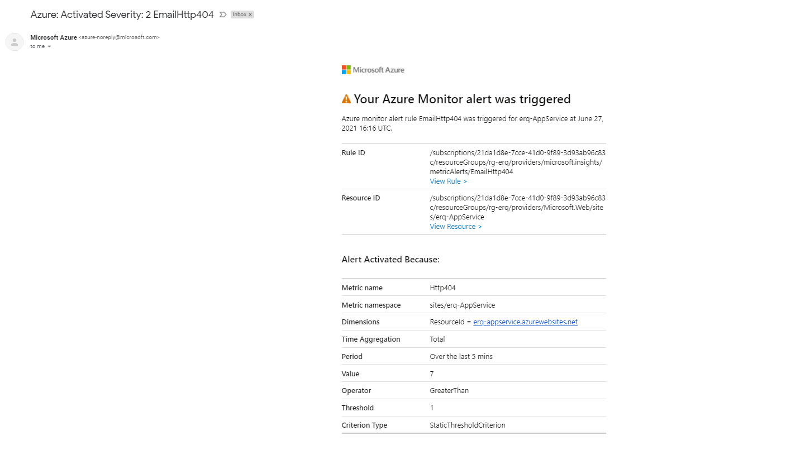  

* Selenium Log Analytics  
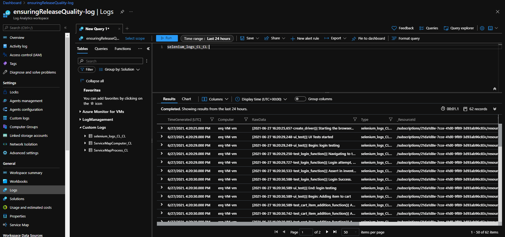  


